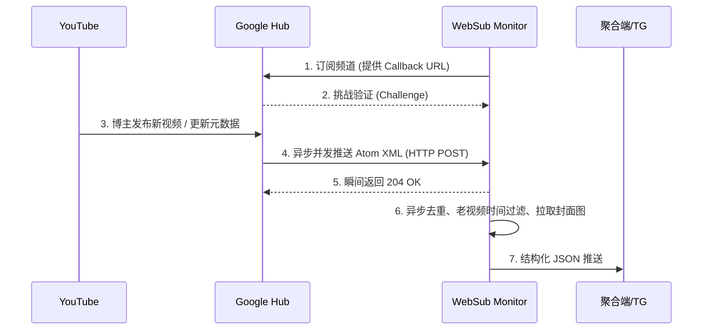

# YouTube WebSub Monitor 🚀

一个工业级、极低延迟的 YouTube 频道视频更新监控推送服务。

基于 Google 官方的 **WebSub (原 PubSubHubbub) 协议** 构建，告别传统的低效轮询（Polling），实现秒级推送延迟！专为对信息时效性要求极高的场景（如 Web3 高频交易预警、全网热点首发抓取）设计。

## 🌟 核心特性

- **⚡ 极限低延迟 (WebSub)**：直接接收 Google Hub 的 HTTP POST 回调，抛弃定时轮询，视频一经发布，毫秒级响应。
- **🛡️ 老视频过滤机制 (防挖坟)**：完美解决 YouTube 博主“批量修改历史视频描述”导致 WebSub 错误重推历史视频的经典大坑。
- **🚀 异步高并发处理**：基于 FastAPI 的底层机制，即刻返回 204 并将解析扔进异步队列，防止因 Google 的并发推送引起阻塞。
- **🔄 全自动租期续订**：Google WebSub 订阅拥有生命周期（默认5天），本服务自带守护进程提前自动续签。
- **💾 轻量级持久化去重**：自带 SQLite 数据库，并搭配 7 天历史记录的自动清理守护进程，防止空间无限膨胀。
- **📡 元数据深层丰富**：自带 YouTube Data API 集成，自动抓取并拼装高清封面图（MaxRes）和频道高清头像。

## ⚙️ 工作原理



## 🚀 快速开始

### 1. 环境准备
确保你已安装 Python 3.10+，推荐使用 [uv](https://github.com/astral-sh/uv) 管理依赖：

```bash
uv pip install -r requirements.txt
# 或者
pip install -r requirements.txt
```

### 2. 配置文件
将 `.env.example` 重命名为 `.env` 并填入你的配置：

- `YOUTUBE_API_KEY`: 必填，前往 Google Cloud Console 申请的 YouTube Data API v3 密钥。
- `YT_CALLBACK_DOMAIN`: 必填，**必须是你部署此服务的外网域名或 IP**（如 `yt.yourdomain.com`），Google Hub 会向此域名发送推送。
- `YT_MONITOR_PORT`: 服务运行端口（默认 8000）。
- `ENABLE_WEBHOOK_PUSH` / `APP_HOST`: 控制是否将视频信息推送到自建后端的 Webhook 接口。
- `ENABLE_TG_PUSH` / `TG_BOT_TOKEN` / `TG_CHAT_ID`: 控制是否直接将新视频提醒推送至 Telegram 频道或个人。

### 3. 启动服务

```bash
# 直接运行脚本
python youtube_monitor.py
# 或使用 uvicorn 生产级启动
uvicorn youtube_monitor:app --host 0.0.0.0 --port 8000
```

## 🛠️ API 接口 (需带 Bearer Token)

服务启动后，内置了管理 API，你可以动态增删监控频道。

### 获取当前监控列表
```bash
curl -X GET "http://127.0.0.1:8000/api/channels" \
     -H "Authorization: Bearer <YOUR_YT_ADMIN_KEY>"
```

### 动态添加新频道
```bash
curl -X POST "http://127.0.0.1:8000/api/channels" \
     -H "Authorization: Bearer <YOUR_YT_ADMIN_KEY>" \
     -H "Content-Type: application/json" \
     -d '{"handle": "@BinanceYoutube", "name": "Binance"}'
```

## 💡 架构进阶：如何抢占物理网络延迟？

对于追求极限延迟的高频交易者：建议在全球多个地区（美东、日本、欧洲）的 VPS 上同时部署此监控节点，配置不同的 Callback 域名。
利用 Google 内部分布式队列的分发随机性与物理路由距离差异（Queue Lottery & Edge Routing），抢占毫秒级的“首发”推送，最终在你的主控端进行去重！

## 📄 License
MIT License
